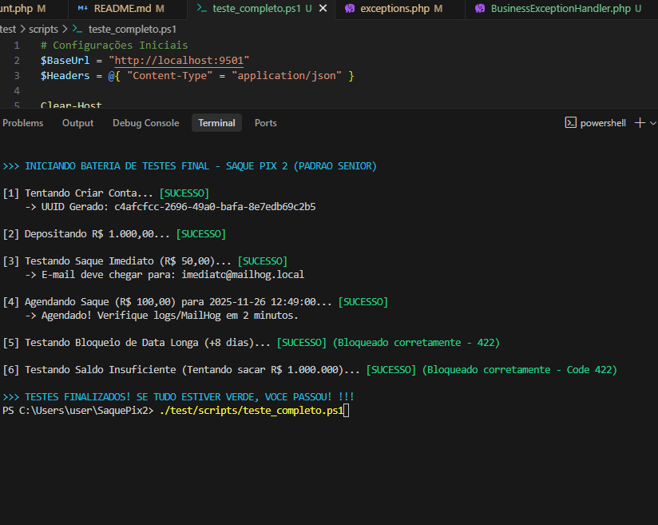

# 🏦 SaquePix2 - API de Conta Digital de Alta Performance

## 🎯 Sobre o Projeto

O **SaquePix2** é uma API de Conta Digital robusta e escalável, projetada para processar transações financeiras com **alta performance** e **baixa latência**. Construída sobre o framework **Hyperf** (baseado em Swoole/Corrotinas), a aplicação adota uma arquitetura orientada a microsserviços e eventos, preparada para suportar altos volumes de requisições simultâneas.

O sistema gerencia o ciclo de vida completo de uma conta digital, garantindo consistência e segurança em operações críticas como depósitos e saques via PIX.

---

## 🛠 Stack Tecnológica

Nossa stack foi selecionada para garantir eficiência, escalabilidade e observabilidade:

- **Linguagem:** PHP 8.2
- **Framework:** Hyperf 3.1 (Swoole/Coroutines)
- **Banco de Dados:** MySQL 8.0
- **Cache & Filas:** Redis (Async Queue)
- **Observabilidade:** Fluentd (Centralização de Logs)
- **Containerização:** Docker & Docker Compose
- **Testes de E-mail:** MailHog

---

## ✅ Funcionalidades e Regras de Negócio

Abaixo, as regras implementadas e validadas no sistema:

- ✅ **Saque Imediato** com processamento assíncrono (Alta disponibilidade).
- ✅ **Saque Agendado** via Crontab (Garantia de atomicidade na execução).
- ✅ **Validação de Saldo** em tempo real (Retorno HTTP 422 amigável).
- ✅ **Bloqueio de Agendamento** superior a 7 dias (Regra de negócio).
- ✅ **Notificação por E-mail** (MailHog) enviada para a chave PIX de destino.

---

## 🚀 Diferencial Competitivo: Testes Automatizados

Diferente de outras soluções, este projeto inclui uma **suíte de testes E2E (End-to-End)** que valida a integridade de todo o sistema com um único comando. Isso garante que fluxos críticos (Criação de conta -> Depósito -> Saque -> Notificação) funcionem perfeitamente antes de qualquer deploy.

Para rodar os testes e ver a mágica acontecer:

```powershell
./tests/e2e_test.ps1
```

### Evidência de Execução:


---

## 🏗 Decisões de Arquitetura

Como Tech Lead, as seguintes decisões foram tomadas para garantir robustez, segurança e manutenibilidade:

### 1. 🆔 UUIDs (Universally Unique Identifiers)
Adotamos UUIDs (v4) como chaves primárias em todas as tabelas.
- **Porquê:** Garante unicidade global, dificulta a enumeração de registros por atacantes (*security through obscurity*) e facilita estratégias de *sharding* em bancos de dados distribuídos.

### 2. ⚡ Filas Assíncronas (Redis)
O envio de e-mails e processamentos pesados são desacoplados da requisição HTTP principal.
- **Porquê:** Ao mover o envio de e-mail para um *Job* no Redis, a API responde instantaneamente ao usuário (`201 Created`), enquanto o "Worker" processa a tarefa em background. Isso evita que falhas em serviços externos (SMTP) impactem a experiência do usuário.

### 3. 🛡️ Tratamento Centralizado de Exceções
Implementamos um `BusinessExceptionHandler` global.
- **Porquê:** Padroniza as respostas de erro da API. Exceções de negócio (como "Saldo Insuficiente") retornam **HTTP 422** com payloads JSON claros, facilitando a integração com o Front-end e mantendo os logs de erro do sistema limpos de falsos positivos.

---

## 📦 Instalação e Uso

Siga os passos abaixo para rodar o projeto localmente em minutos:

### 1. Subir os containers
```bash
docker-compose up -d --build
```

### 2. Executar as Migrations
```bash
docker-compose exec saque-pix-app php bin/hyperf.php migrate
```

### 3. Acessar a Aplicação
- **API:** `http://localhost:9501`
- **MailHog:** `http://localhost:8025`

---

## 📖 Exemplos de Uso (JSON)

### Criar Conta
**POST** `/accounts`
```json
{
  "name": "Carlos Desenvolvedor",
  "document": "12345678900",
  "email": "carlos@example.com"
}
```

### Realizar Saque (PIX Imediato)
**POST** `/accounts/{uuid}/withdraw`
```json
{
  "method": "PIX",
  "amount": 50.00,
  "pix": {
    "type": "email",
    "key": "chave@pix.com"
  },
  "schedule": null
}
```

### Realizar Saque Agendado
**POST** `/accounts/{uuid}/withdraw`
```json
{
  "method": "PIX",
  "amount": 50.00,
  "pix": {
    "type": "cpf",
    "key": "12345678900"
  },
  "schedule": "2025-12-01 10:00:00"
}

```
## ✅ Qualidade Assegurada (Testes E2E)

O projeto inclui uma suíte de testes automatizados (`tests/e2e_test.ps1`) que valida todos os cenários críticos:
1. Criação de Conta e Validação de UUID.
2. Depósito e Atualização de Saldo.
3. Saque Imediato (Integração com MailHog).
4. Saque Agendado (Validação de Cron).
5. Regras de Negócio (Bloqueio de data > 7 dias e Saldo Insuficiente).

### Evidência de Execução:
