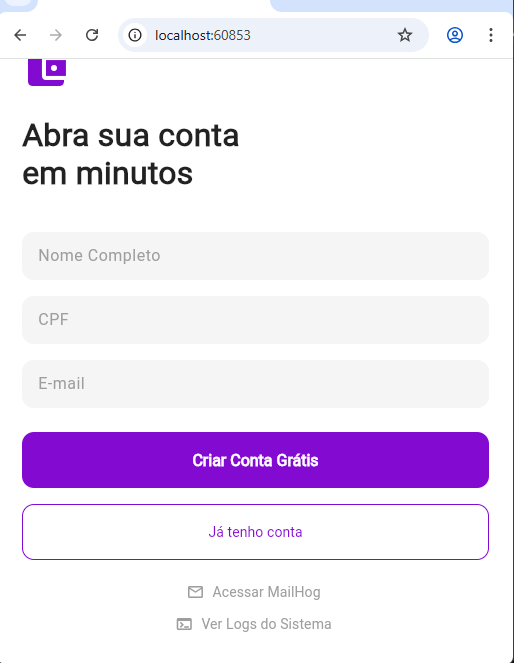
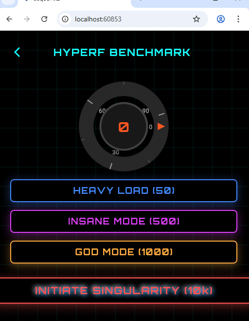
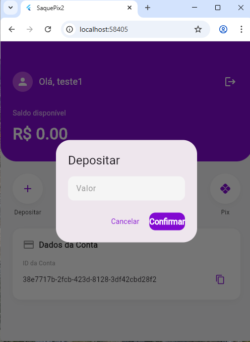
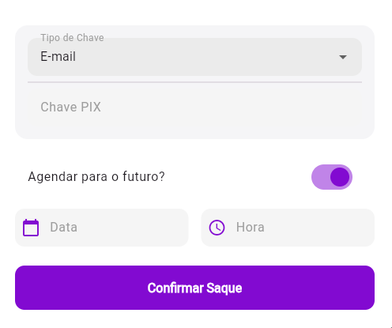

# 🏦 SaquePix2 - API de Conta Digital de Alta Performance

## 🎯 Sobre o Projeto

O **SaquePix2** é uma API de Conta Digital robusta e escalável, projetada para processar transações financeiras com **alta performance** e **baixa latência**. Construída sobre o framework **Hyperf** (baseado em Swoole/Corrotinas), a aplicação adota uma arquitetura orientada a microsserviços e eventos, preparada para suportar altos volumes de requisições simultâneas.

O sistema gerencia o ciclo de vida completo de uma conta digital, garantindo consistência e segurança em operações críticas como depósitos e saques via PIX.

---


---

## 🛠 Stack Tecnológica

Nossa stack foi selecionada para garantir eficiência, escalabilidade e observabilidade:

- **Linguagem:** PHP 8.2
- **Framework:** Hyperf 3.1 (Swoole/Coroutines)
- **Banco de Dados:** MySQL 8.0
- **Cache & Filas:** Redis (Async Queue)
- **Observabilidade:** Fluentd (Centralização de Logs)
- **Containerização:** Docker & Docker Compose
- **Testes de E-mail:** MailHog

---

## ✅ Funcionalidades e Regras de Negócio

Abaixo, as regras implementadas e validadas no sistema:

- ✅ **Saque Imediato** com processamento assíncrono (Alta disponibilidade).
- ✅ **Saque Agendado** via Crontab (Garantia de atomicidade na execução).
- ✅ **Validação de Saldo** em tempo real (Retorno HTTP 422 amigável).
- ✅ **Bloqueio de Agendamento** superior a 7 dias (Regra de negócio).
- ✅ **Notificação por E-mail** (MailHog) enviada para a chave PIX de destino.

---

---


## 🚀 Diferencial Competitivo: Testes Automatizados

Diferente de outras soluções, este projeto inclui uma **suíte de testes E2E (End-to-End)** que valida a integridade de todo o sistema com um único comando. Isso garante que fluxos críticos (Criação de conta -> Depósito -> Saque -> Notificação) funcionem perfeitamente antes de qualquer deploy.

Para rodar os testes e ver a mágica acontecer:

```powershell
./test/scripts/teste_completo.ps1
```

### Evidência de Execução:


---

## 🏗 Decisões de Arquitetura

Como Tech Lead, as seguintes decisões foram tomadas para garantir robustez, segurança e manutenibilidade:

### 1. 🆔 UUIDs (Universally Unique Identifiers)
Adotamos UUIDs (v4) como chaves primárias em todas as tabelas.
- **Porquê:** Garante unicidade global, dificulta a enumeração de registros por atacantes (*security through obscurity*) e facilita estratégias de *sharding* em bancos de dados distribuídos.

### 2. ⚡ Filas Assíncronas (Redis)
O envio de e-mails e processamentos pesados são desacoplados da requisição HTTP principal.
- **Porquê:** Ao mover o envio de e-mail para um *Job* no Redis, a API responde instantaneamente ao usuário (`201 Created`), enquanto o "Worker" processa a tarefa em background. Isso evita que falhas em serviços externos (SMTP) impactem a experiência do usuário.

### 3. 🛡️ Tratamento Centralizado de Exceções
Implementamos um `BusinessExceptionHandler` global.
- **Porquê:** Padroniza as respostas de erro da API. Exceções de negócio (como "Saldo Insuficiente") retornam **HTTP 422** com payloads JSON claros, facilitando a integração com o Front-end e mantendo os logs de erro do sistema limpos de falsos positivos.

---

## 📦 Instalação e Uso

Siga os passos abaixo para rodar o projeto localmente em minutos:

### 1. Subir os containers
```bash
docker-compose up -d --build
```

### 2. Executar as Migrations
```bash
docker-compose exec saque-pix-app php bin/hyperf.php migrate
```

### 3. Acessar a Aplicação
- **API:** `http://localhost:9501`
- **MailHog:** `http://localhost:8025`

---

## � Ferramentas de Desenvolvimento

Facilitamos a vida do desenvolvedor com atalhos diretos na interface:

### 1. Ver E-mails (MailHog) e Logs
No rodapé da tela de login/cadastro, você encontra links rápidos para inspecionar o sistema:
- **Acessar MailHog:** Abre a caixa de entrada para ver os e-mails de notificação de saque.
- **Ver Logs do Sistema:** Exibe os logs da aplicação em tempo real.



### 2. Benchmark Visual
Acesse o menu lateral para visualizar o **Hyperf Benchmark**, onde você pode estressar a API e ver o ponteiro do velocímetro subir!



---

## �📖 Exemplos de Uso (JSON)

### Criar Conta
**POST** `/accounts`
```json
{
  "name": "Carlos Desenvolvedor",
  "document": "12345678900",
  "email": "carlos@example.com"
}
```

### Realizar Saque (PIX Imediato)
**POST** `/accounts/{uuid}/withdraw`
```json
{
  "method": "PIX",
  "amount": 50.00,
  "pix": {
    "type": "email",
    "key": "chave@pix.com"
  },
  "schedule": null
}
```

### Realizar Saque Agendado
**POST** `/accounts/{uuid}/withdraw`
```json
{
  "method": "PIX",
  "amount": 50.00,
  "pix": {
    "type": "cpf",
    "key": "12345678900"
  },
  "schedule": "2025-12-01 10:00:00"
}

```
## 📱 Interface do Usuário (Frontend)

O projeto conta com um frontend moderno desenvolvido em **Flutter Web**, consumindo a API Hyperf.

| Dashboard / Home | Criação de Conta |
| :---: | :---: |
|  |  |

| Área de Depósito | Solicitação de Saque |
| :---: | :---: |
|  |  |

| Feedback de Sucesso | |
| :---: | :---: |
|  | |

### 📅 Demonstração: Saque Agendado

**1. No App (Frontend):**

*Tela de sucesso no aplicativo após o usuário confirmar o agendamento para uma data futura.*

**2. No E-mail (Backend/Cron):**

*Comprovante recebido no MailHog (ambiente de testes) confirmando que o Cron Job processou o agendamento na hora correta.*

## ✅ Qualidade Assegurada (Testes E2E)

O projeto inclui uma suíte de testes automatizados (`./test/scripts/teste_completo.ps1`) que valida todos os cenários críticos:
1. Criação de Conta e Validação de UUID.
2. Depósito e Atualização de Saldo.
3. Saque Imediato (Integração com MailHog).
4. Saque Agendado (Validação de Cron).
5. Regras de Negócio (Bloqueio de data > 7 dias e Saldo Insuficiente).

### Evidência de Execução:


A versão online abaixo oferece uma experiência completa e interativa do sistema. Sinta-se à vontade para criar contas, realizar depósitos, agendar saques e explorar todas as funcionalidades diretamente no seu navegador. É o ambiente perfeito para testar o fluxo completo da aplicação sem a necessidade de configurações locais.

<div align="center">
  <video src="https://github.com/user-attachments/assets/035d50e4-85f5-4943-94f9-f3c185086e85" width="100%" controls autoplay loop muted></video>
</div>


## 🚀 Demo Online (Live Preview)

Experimente a aplicação rodando em produção na nuvem (Render.com):

| Serviço | URL |
| :--- | :--- |
| **Frontend (App)** | [https://saque-pix-frontend.onrender.com/](https://saque-pix-frontend.onrender.com/) |
| **Backend (API)** | [https://saque-pix-backend.onrender.com](https://saque-pix-backend.onrender.com) |

> [!NOTE]
> **Instruções Rápidas:** O ambiente de produção está rodando na nuvem. O banco de dados é reiniciado periodicamente.
> Para testar: **Crie uma nova conta** -> **Deposite um valor** -> **Realize o Saque**.

### ☁️ Infraestrutura de Nuvem
Atualmente hospedado no **Render**, utilizando a seguinte arquitetura:
- **Banco de Dados:** PostgreSQL (Instância `dpg-d4k79v8dl3ps73dedvh0-a`)
- **Cache/Fila:** Redis (Instância `red-d4k71ifdiees73bb6d90`)
- **Backend:** Docker Container (Hyperf)
- **Frontend:** Static Site (Flutter Web)


## ⚡ Performance Showcase: O Poder do Async

Para demonstrar a capacidade do Hyperf em lidar com **alta concorrência** e **I/O Blocking**, incluímos um Benchmark interno na aplicação.

### O Cenário "Heavy Load"
Simulamos **50 requisições simultâneas** (ex: consultando 50 APIs de parceiros), onde cada uma leva aleatoriamente entre 0.1s e 0.5s.

### Resultados Reais
| Modo | Tempo Total | Explicação |
| :--- | :--- | :--- |
| **Heavy (50 tasks)** | **~0.5s** | 50 requisições simultâneas. (Sync: ~15s) |
| **Insane (500 tasks)** | **~0.5s** | 500 requisições simultâneas. (Sync: ~2.5min) |
| **God Mode (1k tasks)** | **~0.5s** | 1000 requisições simultâneas. (Sync: ~5min) |
| **SINGULARITY (10k)** | **~6.0s** | **10.000 requisições** em 6 segundos. (Sync: ~50min) 🌌 |

> **Como testar:**
> Acesse: `/benchmark/heavy`, `/benchmark/insane`, `/benchmark/god` ou `/benchmark/singularity`.

### 🏆 Bonus: Hyperf (Async) vs PHP Tradicional (Sync)

Para ilustrar o poder do I/O Não-Bloqueante, compare os resultados abaixo:

| Cenário | PHP Tradicional (Laravel/Symfony) | Hyperf (Swoole/Corrotinas) | Ganho de Performance |
| :--- | :--- | :--- | :--- |
| **50 Requests (Heavy)** | ~15 Segundos | **~0.5 Segundos** | **30x mais rápido** 🚀 |
| **500 Requests (Insane)** | ~2.5 Minutos | **~0.5 Segundos** | **300x mais rápido** 🤯 |
| **1000 Requests (God)** | ~5 Minutos | **~0.5 Segundos** | **600x mais rápido** ⚡ |

> *Nota: Em frameworks tradicionais, cada requisição bloqueia o processo até finalizar (I/O Blocking). No Hyperf, enquanto uma requisição espera (ex: resposta do banco), a CPU processa outras milhares.*

